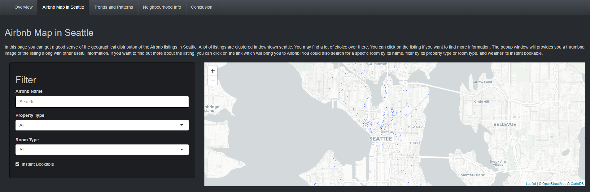
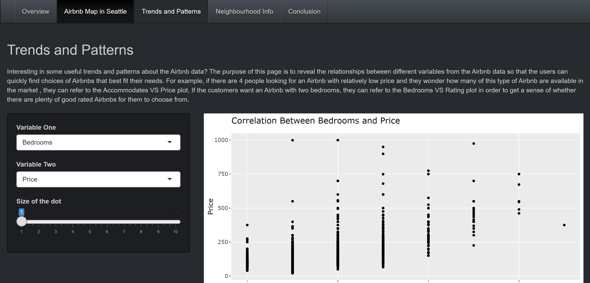
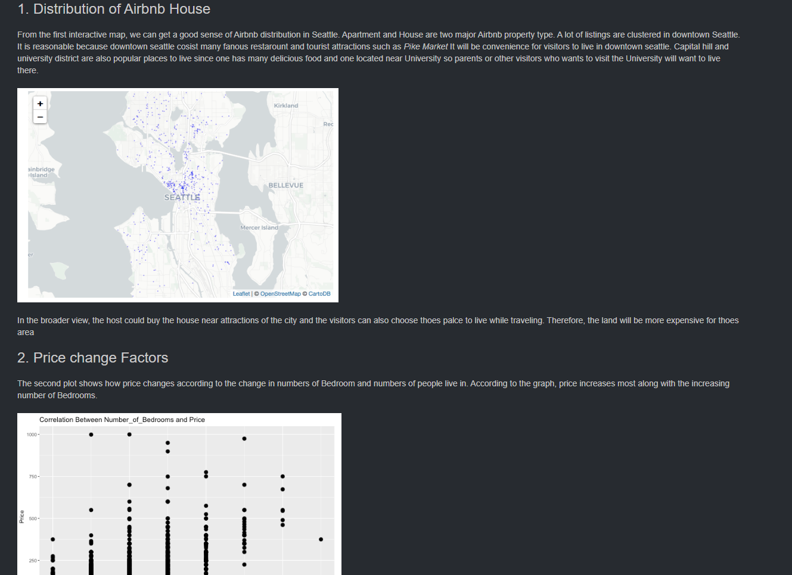

# [Airbnb Data Analysis Project](https://jinghuawang.shinyapps.io/project-JinghuaWang/)

## Project Description
  
This project analyzes the Seattle Airbnb data which is part of the [Seattle Airbnb Open Data]( https://www.kaggle.com/airbnb/seattle#listings.csv). Seattle Airbnb Open Data was collected as part of the Airbnb Inside initiative. It described the listing activity of homestays in Seattle, WA.

In this project, we hope to answer the following questions:
- In 2018, what are the top rated Airbnb listings in Seattle?
- What is the geographical distribution of the Airbnb listings in Seattle?
- What contributes to higher rating and higher listing price?

## Implemation
To answer those questions, our team use R and the Shiny framework to build a data visualization application. The application provides background information, a map of all the listings, an interactive graph that demonstrate the relationship between several key indexes, and an interactive and summative community dashboard.
Since the shiny framework doesn't contain some components(e.g. index cards), I create custom components with HTML and CSS.

<figure>
  
  <figcaption>Geographical distribution</figcaption>
</figure>

<figure>
  
  <figcaption>Relationship between two key indexes</figcaption>
</figure>

<figure>
  
  <figcaption>Insights</figcaption>
</figure>
 
 
### Lastly, don't forget to check out the interactive [project](https://jinghuawang.shinyapps.io/project-JinghuaWang/) which is hosted on [shinyapps.io](https://www.shinyapps.io/)
